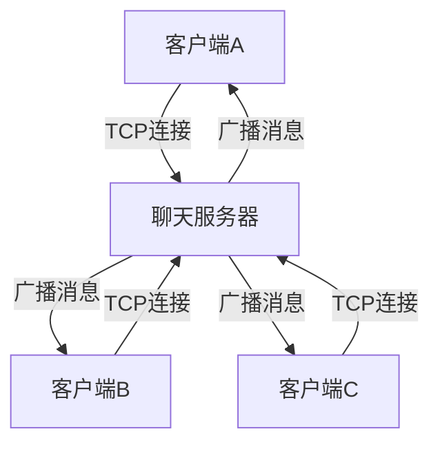
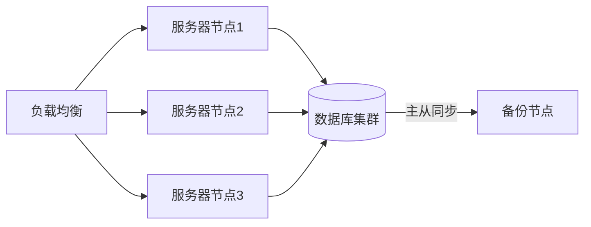
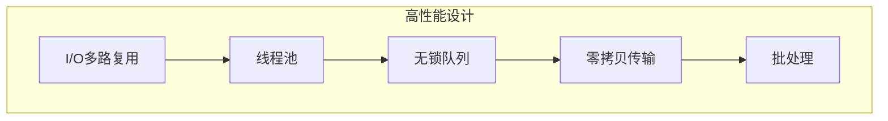
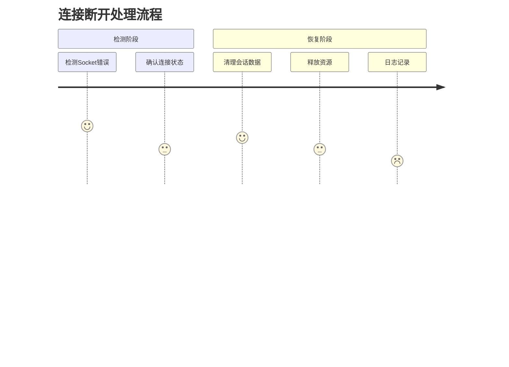
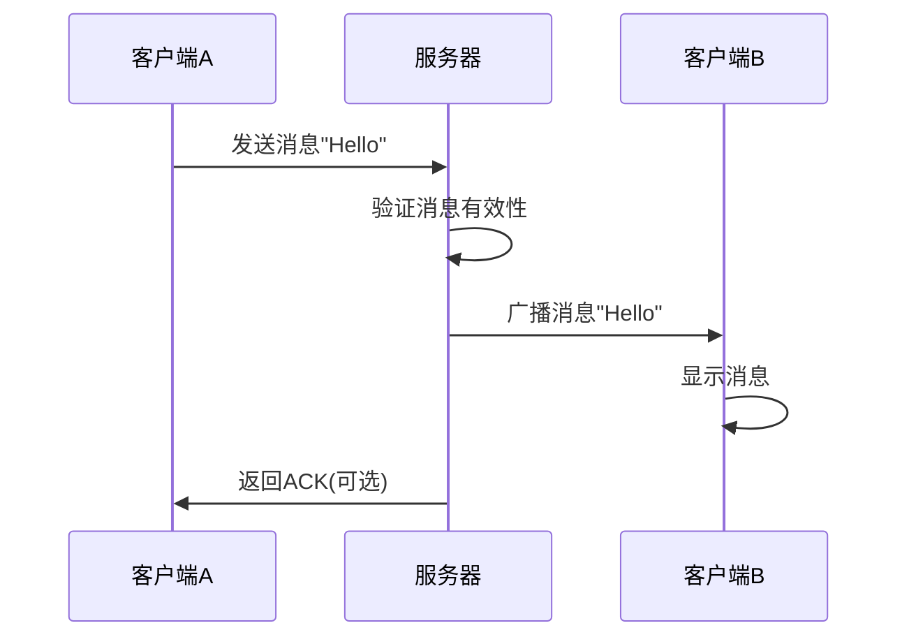
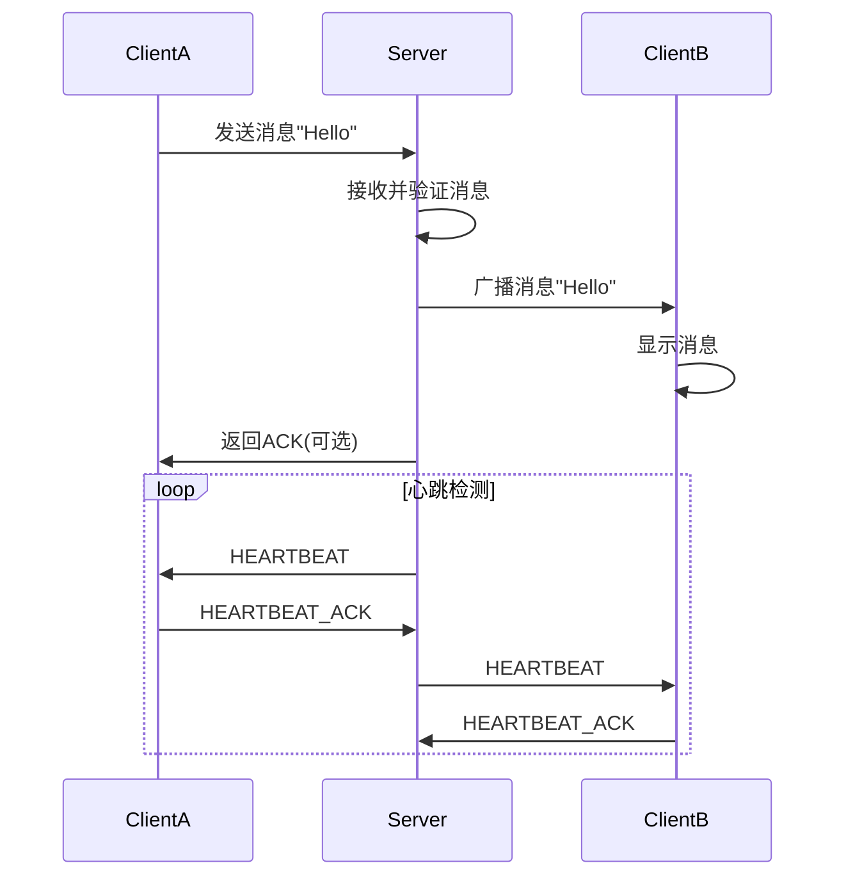

# MyChat

## 目录
[1.了解My Chat](#了解) \
[2.更新历史](#更新) \
[3.研发团队](#团队)

### 了解MyChat软件
> 这是一个开放性的Windows管道通信程序，原理和WeChat、DingTalk、TikTok相似，可以建群聊 \
> 这个程序认准界面(Github Pages)[https://www.github.com],其余全是盗版 \
> 本软件仅供学习和研究使用，切勿用于其他用途（如：商业通途）

```mermaid
gantt
    title 心跳检测周期
    dateFormat  HH:mm:ss
    section 客户端
    发送心跳请求    :a1, 2023-01-01 00:00:00, 1s
    等待响应       :after a1, 3s
    section 服务端
    检测心跳       :2023-01-01 00:00:02, 2s
    超时处理       :crit, 2023-01-01 00:00:05, 1s]\
```

### 更新历史
### Release1.0.0
> 第一个版本

### 研发团队
### RSC Studio
> SYSTEM-WIN12-ZDY [Giithub Page](https://www.github.com/SYSTEM-WIN12-ZDY)
